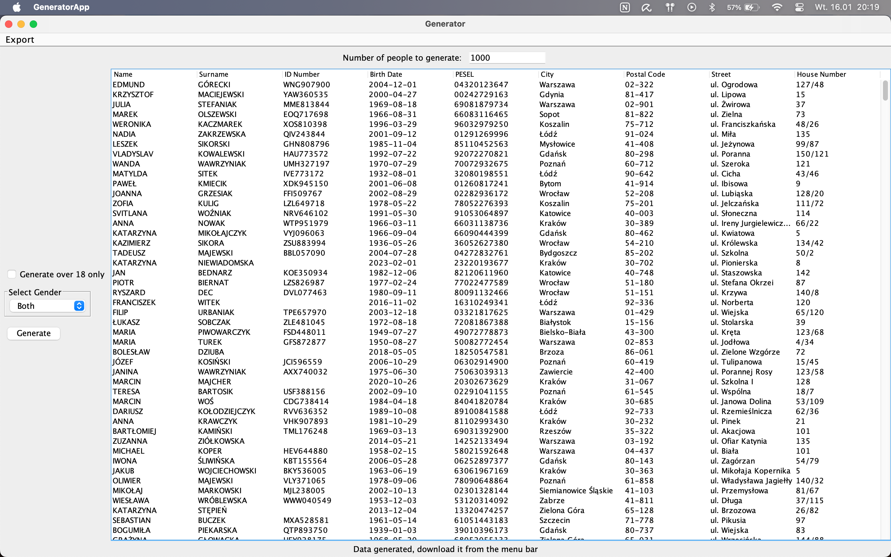
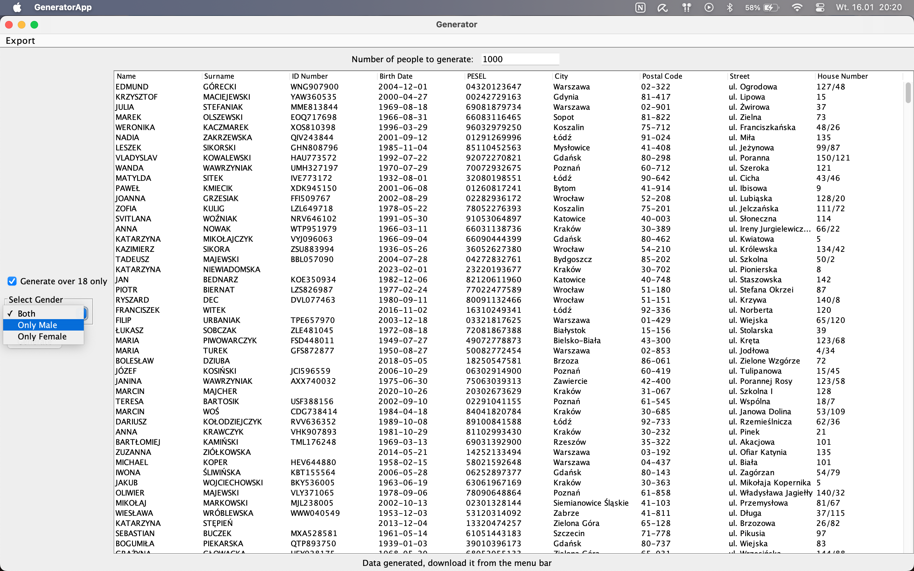
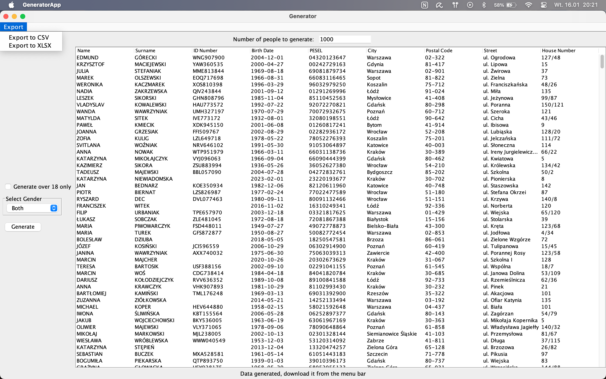

# Personal Data Generator

The Data Generator is a project designed for generating 
synthetic datasets.

## Table of Contents

- Description
- Features
- Usage
- Project Structure & Libraries

## Description

The Data Generator is a programme designed for generating
synthetic datasets tailored for testing purposes.
This versatile tool enables the creation of randomized
data across various categories, including names, surnames, adresses, ID numbers and more.
With a simple and intuitive interface, users can easily customize
data generation to suit specific requirements.
Datasets are generated for residents of Poland (Polish names, surnames, adresses etc.).
## Features

- **Random Data Generation:**  
Generate random:
    - names
    - surnames
    - addresses
    - dates of birth
    - ID Numbers
    - PESEL Numbers
    
- **Saving Generated Data:**  
  Save the generated data to a CSV or XLSX file.

- **Customization Options:**  
  Customise the generated data according to gender, age and number of records.

- **User-Friendly Interface:**  
  Simple and intuitive interface for easy customization and data generation.

## Usage

1. Run the `GeneratorApp` class.
2. Enter the desired number of people to generate in the input field.

3. Optionally, check the "Generate over 18 only" checkbox.
4. Select the gender preference from the dropdown menu.

5. Click the "Generate" button to create random personal data.
6. View the generated data in the table.
7. Export the data to CSV or XLSX using the options in the menu bar.

## Project Structure & libraries
### Used libraries
This project leverages:
- __Apache POI library__ - to facilitate the reading of XLSX files. 
Apache POI proves instrumental in handling Microsoft Office formats,
enabling seamless extraction and manipulation of data within Excel spreadsheets.
- __Java Swing library__ - for creating graphical user interfaces (GUIs).
Swing provides a set of components to design interactive and visually appealing interface.

### Structure

#### Configuration Files

- `pom.xml`: Maven Project Object Model file for dependency management.

#### Directory Structure

- `src/`: Main source directory containing the code.
  - `App/`: Source code for the user interface components.
  - `Data/`: Directory containing XLSX files used for data generation.
  - `DataImporter/`: Source codes responsible for handling the import of external data.
  - `DataSaver/`: Source codes responsible for handling the saving of the data within the application.
  - `PersonalDataGenerator/`: Source codes for generating synthetic personal data within the application. 
  This directory includes classes and modules responsible for creating randomized personal information.
  - `DataStructures/`: Directory containing configuration files concerning application's settings and mappings.

#### Source Files

Below is a list of key source files in the project, organized by their respective directories.

#### `src/DataImporter/`
- `Importer.java`: Class responsible for handling the import of data from XLSX files
provided in `Data/` directory.

#### `src/DataSaver/`
- `Saver.java`: Class responsible for handling the saving of generated data to XLSX or CSV files.
File path is provided by the user.

#### `src/PersonalDataGenerator/`

- `BirthDateGenerator.java`: Class for generating random date of birth.
- `HouseNumberGenerator.java`: Class for creating random house and street numbers.
- `IdNumberGenerator.java`: Class for generating ID Number in accordance with established regulations.
- `PeselGenerator.java`: Class for generating PESEL Number in accordance with established regulations.
- `Generator.java`: Class that provides functionality to generate random personal data, 
including names, surnames, addresses, and other details,
with options to customize the gender and age constraints of the generated individuals. 